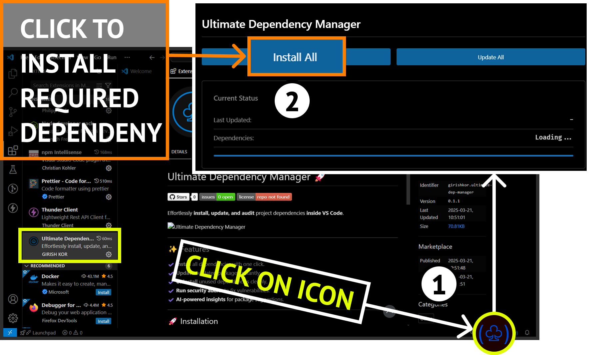

# Ultimate Dependency Manager 🚀

Effortlessly **install, update, and audit** project dependencies **inside VS Code**.

---

## ✨ Features

✔️ **Install** all dependencies with one click  
✔️ **Update** outdated packages instantly  
✔️ **Uninstall** unused dependencies cleanly  
✔️ **Run security audits** to fix vulnerabilities  

---

## 🚀 Installation

1️⃣ Open **VS Code**  
2️⃣ Go to **Extensions** (`Ctrl+Shift+X`)  
3️⃣ Search for **Ultimate Dependency Manager**  
4️⃣ Click **Install**

---

## 🛠️ Usage

### 📌 Open the Dependency Panel

- **Command Palette** (`Ctrl+Shift+P`) → `Show Ultimate Dependency Manager`
- **Explorer Panel** → **Dependencies** section

### 🔧 Manage Dependencies

- **Install**: `Install Dependencies`
- **Update**: `Update Dependencies`
- **Uninstall**: `Uninstall Dependency`
- **Audit**: `Run Security Audit`
- **Refresh**: `Refresh Dependency Tree`

## 📌 Commands

| Command                        | Description                   |
| ------------------------------ | ----------------------------- |
| `Show Ultimate Dependency Manager` | Open the management panel    |
| `Install Dependencies`         | Install all dependencies      |
| `Uninstall Dependency`         | Remove a specific dependency  |
| `Update Dependencies`          | Update outdated packages      |
| `Run Security Audit`           | Fix security vulnerabilities  |
| `Refresh Dependency Tree`      | Refresh the dependency view   |

---

## 🔗 Links

- **GitHub**: [girish-kor/ultimate-dep-manager](https://github.com/girish-kor/ultimate-dep-manager)
- **Issue Tracker**: [Report an issue](https://github.com/girish-kor/ultimate-dep-manager/issues)

---

## 📜 License

This project is licensed under the **MIT License** - see the [LICENSE](LICENSE) file for details.

# 🚀 Happy Coding!
